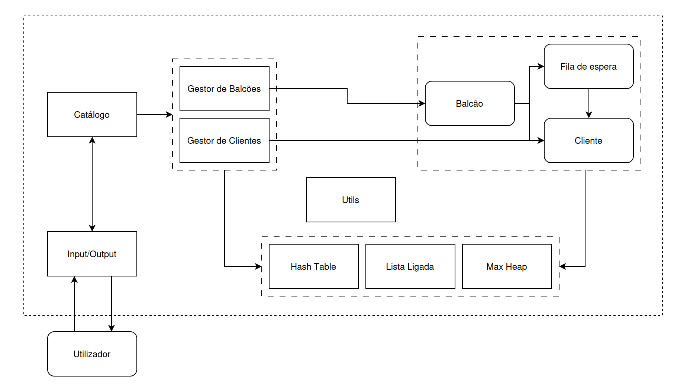

# Balcões de Registo

Considere um sistema de gestão dos balcões de registos portugueses. O sistema contém um conjunto de balcões, definidos pelo seu id, nome, localização, e horário de atendimento. A cada balcão estão associados vários clientes (um cliente pode estar associado a vários balcões), definidos pelo número de cartão de cidadão, nome, data de nascimento, e morada. Considere ainda que cada balcão pode ter múltiplas filas de espera, uma por cada serviço prestado (definido pelo nome, e.g., "Renovar cartão de cidadão"), sendo que a fila deverá dar prioridade de atendimento a utilizadores com mais de 80 anos.

O sistema deverá suportar as seguintes operações:
- Consultar a informação de um cliente, fornecendo o seu número de cartão de cidadão;
- Consultar a lista de clientes de um balcão, fornecendo o seu id;
- Num dado balcão, adicionar um cliente a uma fila de espera, fornecendo o id do balcão, o número de cartão de cidadão do cliente, e o nome do serviço em questão;
- Num dado serviço de um balcão, chamar (i.e., remover) o primeiro cliente na fila, fornecendo o id do balcão e o nome do serviço.

## Entidades

Entidades identificadas:
- Cliente (cartão de cidadão, nome, data de nascimento, morada)
- Fila de espera (nome, coleção de clientes)
- Balcão (id, nome, localização, horário de atentimento, coleção de clientes, coleção de filas de espera)

## Módulos

Módulos identificados:
- Gestor de clientes (coleção de clientes)
- Gestor de balcões (coleção de balcões)
- Catálogo, gestor global
- Módulo de utilidade
- Módulo de Input/Output

Para consultar a informação de um cliente, basta aceder à coleção de clientes no gestor de clientes.
Para consultar a lista de clientes de um balcão, selecionamos o balcão, pegamos no conteúdo da coleção de clientes, e requisitamos ao gestor de clientes a informação de cada cliente.
Para adicionar um cliente de uma fila de espera, selecionamos o balcão, através do gestor, pegamos na coleção de filas de espera, procura-se a fila de espera desejada e adiciona-se o cliente.
Para remover um cliente de uma fila de espera, selecionamos o balcão, através do gestor, pegamos na coleção de filas de espera, procura-se a fila de espera desejada e remove-se o cliente.

## Estruturas de Dados

Estruturas de dados identificadas:
- Hash table (gestor de clientes -> clientes | gestor de balcões -> balcões)
- Max Heap (fila de espera -> clientes)
- Lista Ligada (balcão -> filas de espera | balcão -> clientes)

## Arquitetura

